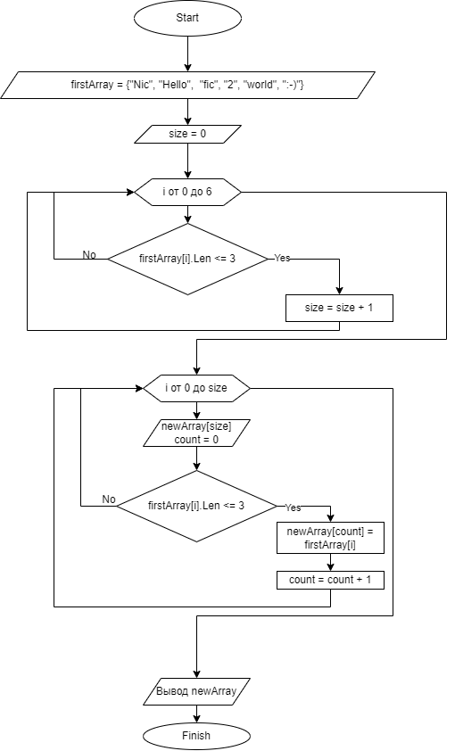

В данном репозитории находится решение следующей задачи на языке C#:

Задача: Написать программу, которая из имеющегося массива строк формирует новый массив из строк, длина которых меньше, либо равна 3 символам. Первоначальный массив можно ввести с клавиатуры, либо задать на старте выполнения алгоритма. При решении не рекомендуется пользоваться коллекциями, лучше обойтись исключительно массивами.

Примеры:
[“Hello”, “2”, “world”, “:-)”] → [“2”, “:-)”]
[“1234”, “1567”, “-2”, “computer science”] → [“-2”]
[“Russia”, “Denmark”, “Kazan”] → []

В решении используется три метода:

1. SizeNewArray, принимающий аргументом массив элеметов типа string, и возвращающий количество элементов, длина которых не превышает 3 символов. Указанное значение будет использовано, как длина нового массива.
2. ArrayOfLengthIsThree, принимающий аргументами исходный массив с элементами типа string и размер нового массива. Возвращающий новый массив элементов типа string, длина которых не превышает 3 символов. Размер нового массива был определен в предыдущем методе.
3. ShowArray, не возвращающий результат, а только выводящий на экран массив, переданный ему аргументом.

В методе SizeNewArray для определения длины нового массива использовалась переменная size. Изначально приравненная к нулю. Далее для определения size использовался следующий код:

```C#
if(array[i].Length <= 3) size += 1;
```


В методе ArrayOfLengthIsThree создается новый массив с элементами типа string. Длина массива передается методу аргументом size. В новый массив записываются элемнты исходного, длина которых не превышает 3 символов. В качестве счетчика элементов нового массива используется переменная count. При этом значение count увеличивается на 1 только после записи очередного элемента в новый массив:

```C#
if(array[i].Length <= 3)
    {
        newArray[count] = array[i];
        count += 1;
    }
```
Метод ShowArray используя цикл for выводит на экран элементы массива, переданного ему аргументом:
```C#
for (int i = 0; i < array.Length; i++)
    {
        Console.Write(array[i] + " ");
    }
```

Блок-схема решения задачи выглядит так:



